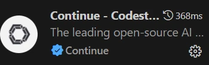
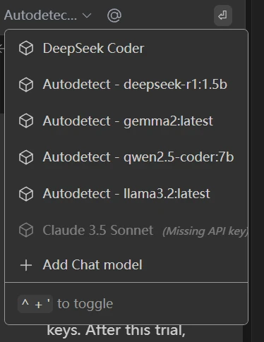
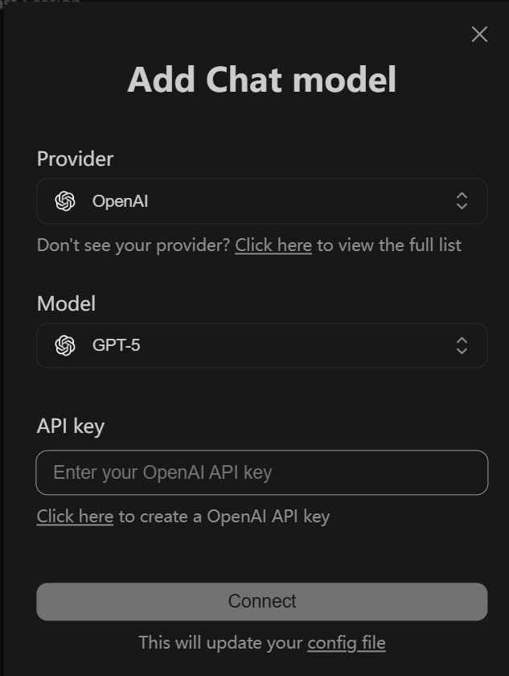
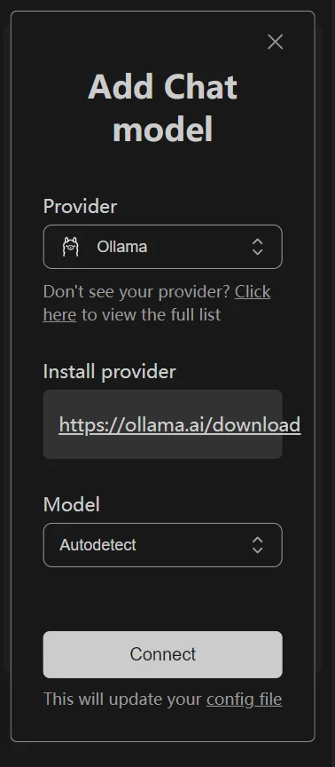
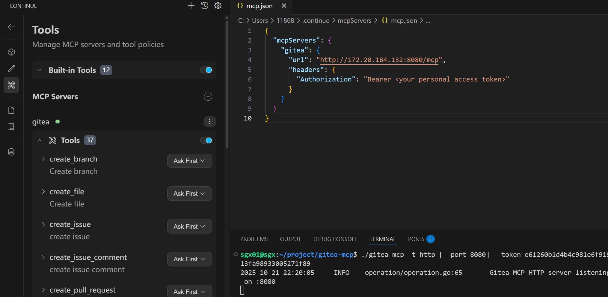

# DevStar AI DevOps

DevStar AI DevOps 是一个完整的AI驱动研发平台解决方案，通过集成 DevStar平台、代码大语言模型、Gitea MCP Server和 AI IDE（Cursor、Claude Code、iFlow等），为开发者提供智能化研发支撑体系。

## 🚀 快速部署

### 一、部署 DevStar 代码托管平台

在Ubuntu-20.04下完成安装：

```
wget -c https://devstar.cn/assets/install.sh && chmod +x install.sh && sudo ./install.sh

sudo devstar start
```

### 二、配置AI IDE（continue cline cursor（cursor不支持内网））

#### 4.1 Continue.dev 配置

打开VScode，在扩展管理中搜索“continue"



#### 4.2 LLM配置

点击Add Chat model，选择自己想要的模型类型。



选择相应的模型 provider 并填写你的api key



使用Ollama本地部署的LLM，相关配置如下图    📖 [本地部署LLM指南](docs/deploy-llm.md)




#### 4.3 MCP配置

安装Gitea MCP 📖 [详细配置指南](docs/devstar-mcp.md)

将 JSON 配置文件直接复制到 `.continue/mcpServers/` 目录中（注意复数“Servers”），Continue 将自动获取它们。




#### 4.4 其他AI IDE配置

#### 4.4.1 Cline配置

📖 [Cline配置指南](docs/cline.md)

#### 4.4.2cursor配置

**Cursor在内网无法使用私有部署的大模型，如果需要在内网使用，请配置continue.dev或Cline**

📖 [Cursor配置指南](docs/cursor.md)

## 📖 使用示例

### 常用工具列表

DevStar MCP 服务器提供以下常用工具，帮助您高效管理 Gitea 仓库：

| 工具名称 | 功能分类 | 描述 | 使用示例 |
|---------|---------|------|----------|
| **get_my_user_info** | 🔐 用户管理 | 获取已认证用户信息 | [查看示例](docs/example.md#get_my_user_info) |
| **search_users** | 🔐 用户管理 | 搜索用户 | [查看示例](docs/example.md#search_users) |
| **create_repo** | 📦 仓库管理 | 创建新仓库 | [查看示例](docs/example.md#create_repo) |
| **list_my_repos** | 📦 仓库管理 | 列出用户拥有的仓库 | [查看示例](docs/example.md#list_my_repos) |
| **search_repos** | 📦 仓库管理 | 搜索仓库 | [查看示例](docs/example.md#search_repos) |
| **create_branch** | 🌿 分支管理 | 创建新分支 | [查看示例](docs/example.md#create_branch) |
| **delete_branch** | 🌿 分支管理 | 删除分支 | [查看示例](docs/example.md#delete_branch) |
| **list_branches** | 🌿 分支管理 | 列出仓库分支 | [查看示例](docs/example.md#list_branches) |
| **create_issue** | 🐛 问题管理 | 创建新问题 | [查看示例](docs/example.md#create_issue) |
| **list_repo_issues** | 🐛 问题管理 | 列出仓库问题 | [查看示例](docs/example.md#list_repo_issues) |
| **create_issue_comment** | 🐛 问题管理 | 创建问题评论 | [查看示例](docs/example.md#create_issue_comment) |
| **edit_issue_comment** | 🐛 问题管理 | 编辑问题评论 | [查看示例](docs/example.md#edit_issue_comment) |
| **create_pull_request** | 🔄 拉取请求 | 创建拉取请求 | [查看示例](docs/example.md#create_pull_request) |
| **list_repo_pull_requests** | 🔄 拉取请求 | 列出拉取请求 | [查看示例](docs/example.md#list_repo_pull_requests) |

完整的 [使用示例](docs/workflow.md)

[工具列表](docs/list.md)

## 🔧 高级配置

### AI 代码审查
配置自动化的代码审查流程，提升代码质量：

📖 [代码审查配置指南](docs/codereview.md)

## 📄 许可证

本项目遵循 MIT 许可证。商业使用请联系 contact@mengning.com.cn

## 🔗 相关链接

- [DevStar 主项目](https://github.com/mengning/DevStar)
- [在线演示](docs/workflow.md)
- [Gitea MCP 项目](https://gitea.com/gitea/gitea-mcp)
- [Cursor IDE](https://cursor.sh)

---

**开始您的 AI 驱动开发之旅！** 🚀

