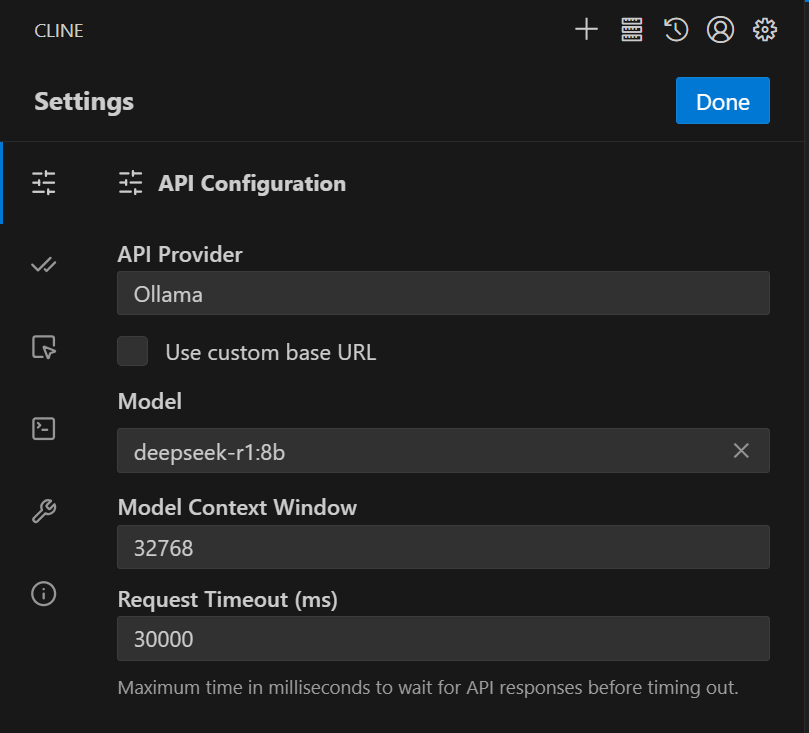
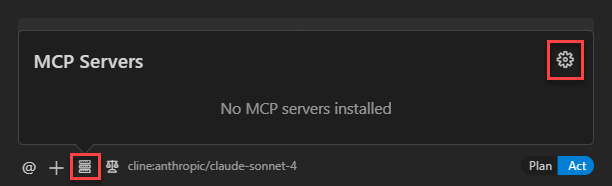
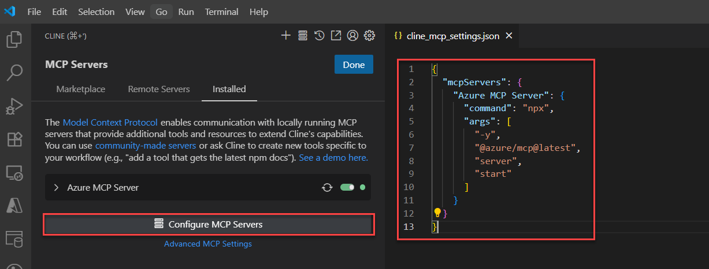

## Cline配置

### 1 本地LLM

在settings找到 “Provider / API provider” 部分

选择 Ollama
填写 Base URL，通常是 http://localhost:11434/（默认 Ollama 的 API 端口） 
选择你想用的模型（已经通过 Ollama pull 下来的）

### 2 MCP

选择“ **管理 MCP 服务器** ”以打开 **MCP 服务器** 浮出控件，然后选择 **“设置”** 图标。

在面板的 **MCP 服务器** 部分中，选择“ **配置 MCP 服务器** ”以打开 `cline_mcp_settings.json` 文件进行编辑。

将continue中配置添加到 `mcpServers` JSON 对象：

